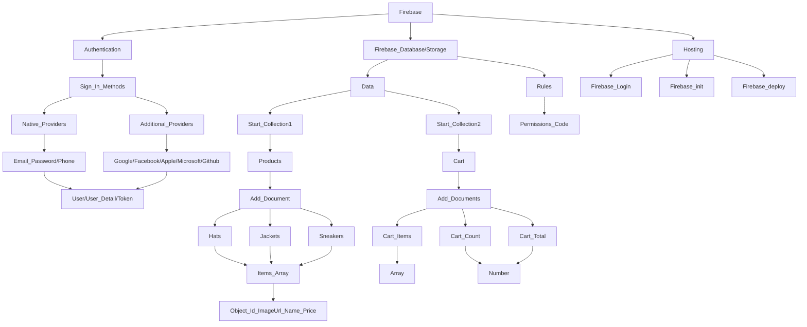

 
# Firebase Technical Paper

## Some Reading Notes 

### Authentication:-
Firebase Authentication provides backend services to help authenticate users in your app. It supports various authentication methods, including email/password and OAuth providers like Google and Facebook.
### Firestore:-
Firestore is a flexible, scalable database for mobile, web, and server development. It provides real-time synchronization and offline support, making it easy to build responsive applications.
### Storage:-
Firebase Storage provides secure file uploads and downloads for Firebase apps. It is designed to scale from petabytes to exabytes, and to handle high-frequency use cases like streaming and uploading media.
### Firebase Hosting:-
is a fully-managed hosting service for static and dynamic content as well as microservices. It provides fast and secure hosting with features such as SSL, custom domains, and auto-scaling.
# 𖦋 -> Firebase Structure Diagram:-

This is Firebase Structure \*For Learning Purpose i created\* 


# 1️⃣-> Authentication Firebase Setup with Firestore Database

#### Setup Code Provided from Firebase after Creating Project/App

`./firebase.ts`
```js
import { initializeApp } from 'firebase/app';
import { getAnalytics } from 'firebase/analytics';
import { getAuth, GoogleAuthProvider } from 'firebase/auth';
import { getFirestore } from 'firebase/firestore';
const firebaseConfig = {
	apiKey: 'xxxxCopy-Paste-from-Firebase-xxxxx',
	authDomain: 'xxx-Project-Domain---xxxx.firebaseapp.com',
	projectId: 'xxxx-domain---',
	storageBucket: 'xxxx-domain---.appspot.com',
	messagingSenderId: 'xxx-Number---xxxx',
	appId: 'x:xxxx--AppId------xxx',
	measurementId: 'xxxxx--some--Id',
};
const app = initializeApp(firebaseConfig);
export const auth = getAuth(app);
export const googleProvider = new GoogleAuthProvider();
export const db = getFirestore(app);
const analytics = getAnalytics(app);

```

## Authentication Actions

### Imports ⇣
`./FirebaseAuthActions.ts`
```js
import {
	createUserWithEmailAndPassword,
	onAuthStateChanged,
	signInWithEmailAndPassword,
	signInWithPopup,
	signOut,
} from 'firebase/auth';
import { auth, googleProvider } from './Firebase';
```
### * SignInWithGoogle
```js
export const asyncSignInWithGoogle = async () => {
	return await signInWithPopup(auth, googleProvider);
};
/* Example How to use All Actions Where we Want --Changes is required as per Actions  */

// THIS IS FUNCION
const hancleGoogleSignIn = async () => {
		try {
			const { user } = await asyncSignInWithGoogle();
			// 	console.log(user);
			if (user) {
				await asyncCurrentLoggedInUser();
				setCurrentUser(user);
				navigate('/');
			}
		} catch (error) {
			console.error(error);
		}
	};

//THIS IS UI
<Button onClick={hancleGoogleSignIn}> Continue with Google </Button>
```
### * createUserWithEmailAndPassword 
> This take a <b> Auth, Email, Password </b> as Parameters and Create new Account of User in FireStore
```js
export const asyncCreateUserWithEmailAndPassword = async (email: string, password: string) => {
	return await createUserWithEmailAndPassword(auth, email, password);
};
```
### * SignInUserWithEmailAndPassword
> This also takes a <b> Auth, Email, Password </b> as Parameters and Sign In Successful !!
```js
export const asyncSignInUserWithEmailAndPassword = async (email: string,password: string) => {
	return  signInWithEmailAndPassword(auth, email, password);
};
```
### * onAuthStateChanged || This method check for current User if Logged In Or Not 
> This is Firebase *onAuthStateChanged method for fetch Logged in user !!
```js
import {onAuthStateChanged} from 'firebase/auth';
export const asyncCurrentLoggedInUser = () => {
	return new Promise((resolve, reject) => {
		onAuthStateChanged(auth,user => {
				if (user) {
					resolve(user);
				} else {
					resolve(null);
				}
			},
			reject
);});};
```
### * SignInUserWithEmailAndPassword
> This just take Auth as Parameter and  Signout --> Logged in User !!
```js
export const asyncLogOutUser = async () => {
	return await signOut(auth);
};
```
# 2️⃣-> Firestore Database
`/FirebaseBooksAction.ts`
```js
/*  -----------Books Actions--------- */
export const asynchandleBookFormSubmit = async bookData => {
	const allBooksCollection = collection(db, 'books');
	try {
		if (!bookData.bookName == '' || !bookData.publishDate == '') {
			return await addDoc(allBooksCollection, bookData);
		}
	} catch (error) {console.error(error)}
};

export const asyncGetBooksData = async () => {
	const allBooksCollection = collection(db, 'books');
	try {
		const data = await getDocs(allBooksCollection);
		return data.docs.map(doc => ({...doc.data(),id: doc.id,}));
	} catch (error) {console.error(error)}};

export const asyncHandleEditBook = async (bookId, editedBookName) => {
	try {
		const bookDoc = await doc(db, 'books', bookId);
		return await updateDoc(bookDoc, { title: editedBookName });
	} catch (error) {console.error(error)}};

export const asyncHandleDeleteBook = async bookId => {
	try {
		const bookDoc = doc(db, 'books', bookId);
		await deleteDoc(bookDoc);
	} catch (error) {console.error(error)}};

export const handleUploadFile = async () => {
	if (!uploadFile) return null;
	const fileFolderRef = ref(storage, `booksImages/${uploadFile.name}`);
	try {
		await uploadBytes(fileFolderRef, uploadFile);
	} catch (error) {console.error(error)}};
```
# 3️⃣-> Hosting
>Fire base also Provide Hosting Website/App
For that, After Completing Ourt Project we have to Execute :-
```js
npm run build
```
Which will Generate `dist` || `build` Folder for Deployement where our final `index.html` Presents
Then we have to Setup Hosting Project Procedure which will get from Firebase Hosting Tab ,
There need to some Action like --
`\* First Command for Setup your Firebase Email Id *\`
```js

firebase login
```
There Are the Commands helps if stuck in Login/CLI Setup
`With Firebase CLI you can have multiple accounts logged in.

>Using firebase `login:add` will login another account.

>Using firebase `login:list` will list logged accounts.

>Using firebase `login:use` will set default account for current project directory.`

>And you can use `firebase logout` to logout from Firebase.

🔗 [Reference Link For Reading Login Setup in Terminal](https://stackoverflow.com/questions/75563709/how-could-i-change-my-firebase-login-account-to-another-account-and-login-again)

Next Command is 
```js
firebase init
```
Which will Come-Up with so Many Question like this ;;- Proceed Accordigly-
```js
//Before firebase init make sure that run Build command like 
npm run build
//this after completion this will provide dist/build folder put that name in this line of code 
? What do you want to use as your public directory? Dist
? Configure as a single-page app (rewrite all urls to /index.html)? No
? Set up automatic builds and deploys with GitHub? Yes
✔  Wrote dist/404.html
? File dist/index.html already exists. Overwrite? No
? For which GitHub repository would you like to set up a GitHub workflow? (format: user/repository) Dhaneshwar7/Firebase-Learn
? Set up the workflow to run a build script before every deploy? No
? Set up automatic deployment to your site's live channel when a PR is merged? Yes
? What is the name of the GitHub branch associated with your site's live channel? Main
? The GitHub workflow file for deploying to the live channel already exists. Overwrite?
firebase-hosting-merge.yml No

Final command –  firebase deploy
Hosting URL: https://fir-learn-hk.web.app
```
Done Almost Afte That Last Step 📍
```js
firebase deploy
```


