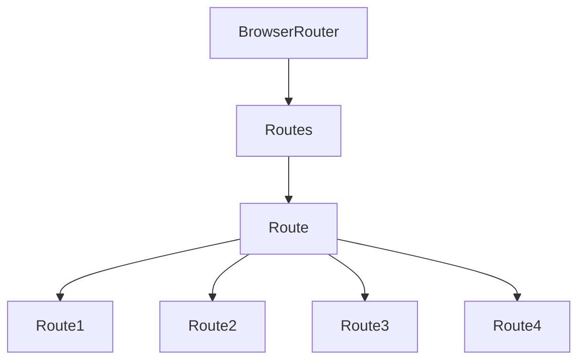

<div align="center">
 	
</div>

# React Router Technical Paper

## Some Reading Notes 

### React Router:-
React Router is a collection of navigational components within your application. With the latest version, React Router v6, there are several new features and improvements over the previous versions. This article will help you understand how to use React Router in a modern React application.

# Where i was Stuck & Solution(R&D) & Learning

>[!NOTE]
>        - Browser Router Structure

`This is /main.tsx`
```js
import { BrowserRouter } from 'react-router-dom';

<BrowserRouter>
     <App />
</BrowserRouter>
```
`This is App.tsx`
```js
import { Route, Routes } from 'react-router-dom';

<Routes>
        <Route path="/" element={<MainLayout />}>
            <Route index element={<HomePage />} />
            <Route path="/shop/*" element={<ShopLayout />}>
                <Route path="all-products" element={<AllProducts />} />
                <Route path=":categoryName" element={<CategoryPreview />} />
            </Route>
            <Route path="/shop/cart-checkout" element={<CartCheckoutPage />} />
            <Route path="/authentication" element={<AuthenticationPage />} />
        </Route>
</Routes>
```


Reading Documentation And Took help of ChatGPT to undestand more
>[Firebase Rules Documentaion]([https://firebase.google.com/docs/firestore/security/get-started?hl=en&authuser=0](https://reactrouter.com/en/main))
>[Structure Data in Firestore]([https://firebase.google.com/docs/firestore/manage-data/structure-data?hl=en&authuser=0](https://reactrouter.com/en/main))


# 𖦋 -> Firebase Structure Diagram:-

This is React Router \*For Learning Purpose i created\* 

