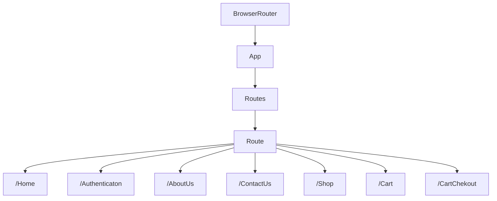

<div align="center">
 	
</div>

# React Router Technical Paper

## Some Reading Notes 

[Official Website React Router 🔗](https://reactrouter.com/en/main)

### React Router:-
React Router is a collection of navigational components within your application. With the latest version, React Router v6, there are several new features and improvements over the previous versions. This article will help you understand how to use React Router in a modern React application.

# Where i was Stuck & Solution(R&D) & Learning

>[!NOTE]
>        - Browser Router Structure

`This is /main.tsx`
```js
import { BrowserRouter } from 'react-router-dom';

<BrowserRouter>
     <App />
</BrowserRouter>
```
`This is App.tsx`
```js
import { Route, Routes } from 'react-router-dom';

<Routes>
        <Route path="/" element={<MainLayout />}>
            <Route index element={<HomePage />} />
            <Route path="/shop/*" element={<ShopLayout />}>
                <Route path="all-products" element={<AllProducts />} />
                <Route path=":categoryName" element={<CategoryPreview />} />
            </Route>
            <Route path="/shop/cart-checkout" element={<CartCheckoutPage />} />
            <Route path="/authentication" element={<AuthenticationPage />} />
        </Route>
</Routes>
```


Reading Documentation And Took help of ChatGPT to undestand more
>[Firebase Rules Documentaion]([https://firebase.google.com/docs/firestore/security/get-started?hl=en&authuser=0](https://reactrouter.com/en/main))
>[Structure Data in Firestore]([https://firebase.google.com/docs/firestore/manage-data/structure-data?hl=en&authuser=0](https://reactrouter.com/en/main))


## 𖦋 -> React Router Structure Diagram:-

This is React Router \*For Learning Purpose i created\* 

## 𖦋 -> Basic Components and Hooks of React Router Which i Used in Task :-

####      * `<Link>`: - A <Link> is an element that lets the user navigate to another page by clicking or tapping on it. In react-router-dom.
```js
import { Link } from "react-router-dom";
const navLinks=[{id:1,link:'/home'},{id:2,link:'/about'},{id:3,link:'/contactus'},{id:4,link:'/auth'}]

function NavigationBar() {
  return (
    <div>
          <span>Logo</span>
          <ul>
               {navLinks.map(nav => (
                    <li key={nav.id}>
                         <Link to={`/${nav.link}`}>{nav?.link.toUpperCase()}</Link>
                    </li>))}
          </ul>
    </div>
  );
}
```
####      * `<NavLink>`: - A <NavLink> is a special kind of <Link> that knows whether or not it is "active", "pending", or "transitioning". 
```js
import { NavLink } from "react-router-dom";
<NavLink
  to="/messages"  className={({ isActive, isPending }) => isPending ? "pending" : isActive ? "active" : ""}>
  Messages
</NavLink>;
```
####      * `<Outlet>`: - An <Outlet> should be used in parent route elements to render their child route elements. This allows nested UI to show up when child routes are rendered. If the parent route matched exactly, it will render a child index route or nothing if there is no index route.

```js
import { Outlet } from 'react-router-dom';
function MainLayout() {
  return (
    <>
     <Header/>
      <Outlet />
     <Footer/>
    </>
  )};

function App() {
  return (
    <Routes>
      <Route path="/" element={<MainLayout />}>
        <Route
          index
          element={<HomePage />}
        />
        <Route path="aboutus" element={<AboutUs />} />
        <Route path="contactus" element={<ContactUs />} />
...etc
      </Route>
    </Routes>
  );
}
```
####      * `<useNavigate>`: - The useNavigate hook returns a function that lets you navigate programmatically, for example in an effect:
```js
import { useNavigate } from "react-router-dom";
const navigate = useNavigate();

const hancleGoogleSignIn = async () => {
     try {
          const { user } = await asyncSignInWithGoogle();
			if (user) {
				await asyncCurrentLoggedInUser();
				navigate('/');
			}
		} catch (error) {
			console.error(error);
     }};
```


